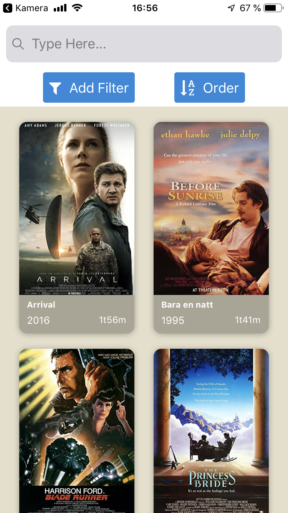
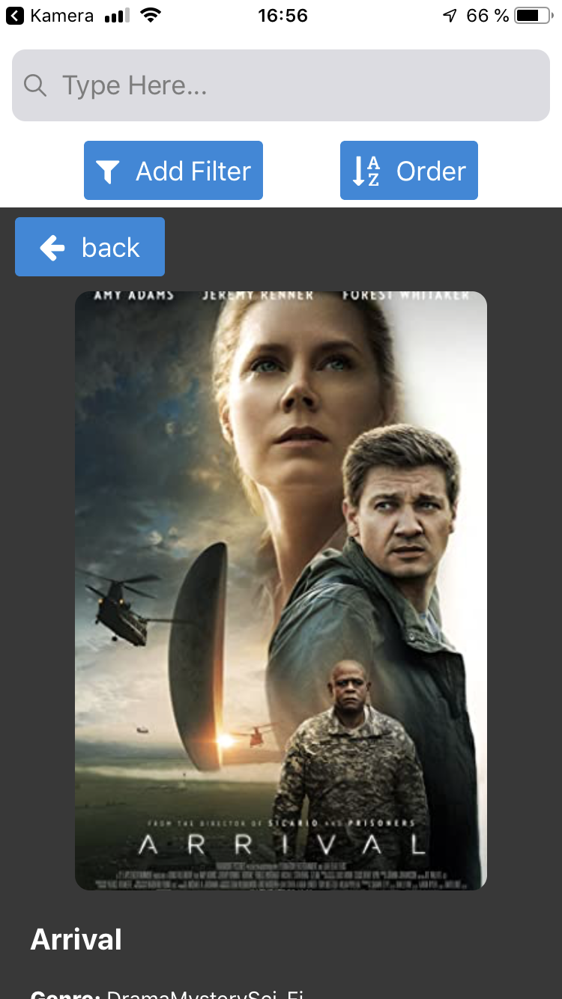
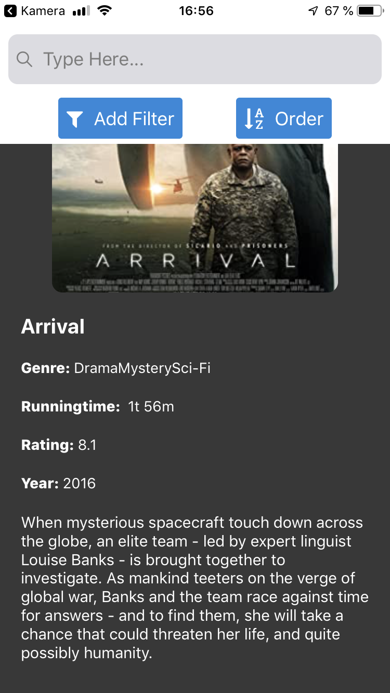
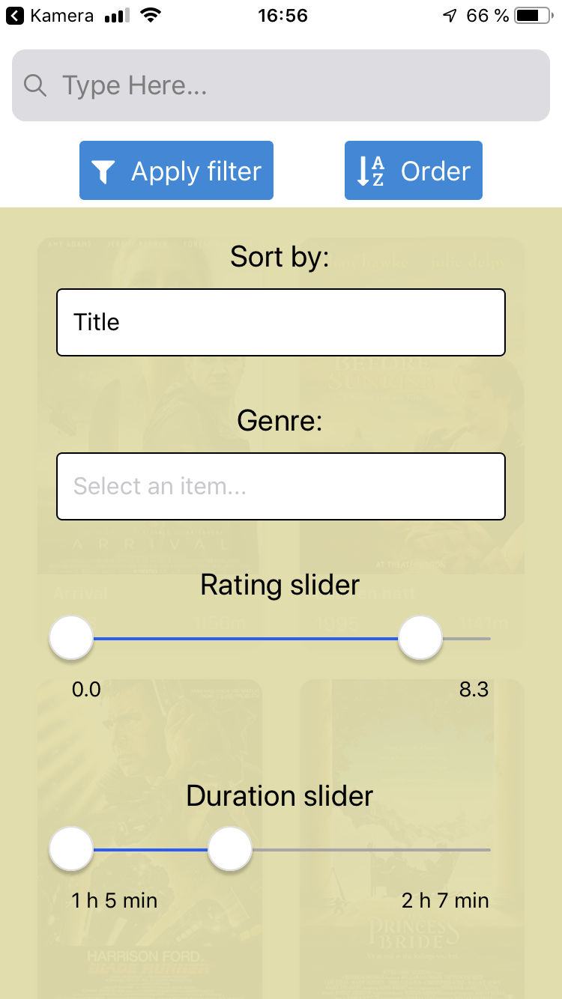

# IT2810: Prosjekt 4 - Filmdatabase App (iOS & Android)

Dette er en mobilapplikasjon for å søke opp informasjon om filmer. Dataen er hentet fra [FEND16](https://github.com/FEND16/movie-json-data?fbclid=IwAR1x59Rv0NctGe8NrlnWahhZGjgEwLFy0ZiUm_mX6ghofQVg_FJUfim-QHM). Databasen for å håndtere filmene kjører på en virtuell maskin av NTNU.
Prosjektet er laget ved en backend som kjøres med node.js, og en frontend med Expo, React Native og typescript. Prosjektet er en vidreføring av [Prosjekt 3](https://github.com/haakonjacobsen/FilmDB-Web) og utviklet av Haakon Jacobsen og Jan Ming Lam.

## Applikasjonsbeskrivelse

### Funksjonalitet og teknologi

- Prototypen er laget ved React Native, og initialisert med `expo init`.
- Vi bruker redux for state management.
- Det er brukt typescript i hele prosjektet. I løsningen vår er det lagt opp til:
  - Søkemulighet ved hjelp av input felt.
  - Filtrerinsgmuligheter ved hjelp av slider, og sortering
  - Dynamisk innlasting ved en knapp i bunnen av resultatlisten.
  - Popup for å gi en mer detaljert beskrivelse av filmen
- Merk at sortering og filtrering overlapper slik at filter vil innskrenke søkemulighetene. Setter du f.eks. minimumscoren til over 5 og søker etter "Fifty Shades", vil du ikke få noen resultater.

### Bruk av tredjepartskomponenteter

- Ettersom React Native ikke kan bruke de samme bibliotekene vi brukte i prosjekt 3, har vi stort sett valgt å bruke komponenter fra [react-native-elements biblioteket](https://reactnativeelements.com).
- Dog hadde ikke React native elements noen gode løsninger på slidere med max og min verdi, så derfor hentet vi MultiSlider fra [ptomasros](https://github.com/ptomasroos/react-native-multi-slider).
- For håndtering av forskjellige lokale ip adresser, har vi brukt [Constants](https://docs.expo.io/versions/latest/sdk/constants/) for hente brukerens lokale IP addresse for fetching. Dette gjør det mulig å hente data på mobil uten å måtte gå inn i koden og manuelt sette IP adresse.

## Styling

- Vi har valgt å lage stylesheets i bunnen av hver komponent da vi synes det er hensiktsmessig å samle styling og komponentkoden sammen da man gjerne jobber med begge deler samtidig.
- Vi har også laget en egen mappe for styling. Her ligger styling som overlapper komponenter med ulikt design for iOS og android.

## Testing

Vi har gjennomført manuelle ende til ende tester, der vi har testet at applikasjonen fungerer som den skal ved ulike brukerinteraksjoner i ulik rekkefølge.
## Endringer fra prosjekt 3
- Vi har overført mye av koden fra prosjekt 3, der vi har benyttet oss av samme Redux oppsett og flere av komponentnavnene. Ettersom prosjektet vårt i prosjekt 3 filtrerte og sorterte noe på backend og noe på frontend, har vi i dette prosjektet valgt å forbedre backenden slik at den er ansvarlig for all innlastning av data. På den måten sikrer vi enda bedre dynamisk innlasting av data, i forhold til det som ble gjort i prosjekt 3.
- Dette prosejktet har ikke fokus på brukergenerert data og innlogging og favoritfilmer er derfor ikke implementert.
- Ved mobilapplikasjoner er innlasting av data mer kritisk med tanke på begrensede datamanegder mange har i mobilabonementet sitt. Det betyr at applikasjonen burde laste inn det den trenger for en god brukeroplevselse, men ikke noe mer. For å unngå unødvendig innlasting av data har vi lagt opp til dynamisk innlasting med 20 filmer av gangen.
- Vi har byttet ut pagiation oppsettet vårt fra prosjekt 3 med en knapp i bunnen av listevisningen som laster inn flere filmer. Dette ble gjort fordi vi synes det var et mer brukervennlig alternativ for mobil.
- Valg av filtrering og sortering skjer i samme panel ved å trykke på "Filter & Sort" knappen som ligger under søkefeltet. Vi har også laget en knapp som bytter mellom å vise resultatet i stigende eller synkende rekkefølge. Dette illustres ved ikoner som endrer seg avhengig om det er tekst eller størrelse/lengde man sorterer etter.
- Vi har også gjort en liten endring ved filtreringen, der vi isteden for å filtrere etter årstall, har valgt å filtrere etter filmens lengde.
- Vi har også valgt gjort flere forbedringer i typing, og nå fjernet noen "any" typinger, ettersom dette ikke er god praksis for typescipt.  

### Setup:

- Klon repoet fra GitLab via `git clone https://gitlab.stud.idi.ntnu.no/it2810-h20/team-ad-hoc/prosjekt-4-haakon-jan.git`
- Sjekk at du er koblet til [VPN](https://innsida.ntnu.no/wiki/-/wiki/Norsk/Installere+VPN) eller [NTNU sitt nettverk](https://innsida.ntnu.no/wiki/-/wiki/Norsk/Trådløst+nett)
- Gå inn i rotmappen ved `cd prosjekt-4-haakon-jan` og kjør`npm install`
- Gå inn i backend mappen fra rotmappen ved `cd backend` og kjør`npm install`

### Kjøre backend:

- Fra backend mappen, kjør`npm start`
- Tilbakemeldingen "Server has started" skal vises i terminalen!

### Kjøre frontend:

- Lag en ny terminal i rotmappen, og kjør `npm start`
- Et browservindu skal åpne seg, og her vises metro bundleren.
- For å teste applikasjonen har du tre valg. Teste på mobil, teste i android simulator, eller teste i iOS simulator. Vi anbefaler å teste på mobil.

### Teste på mobil:

- Sørg for at mobilen er på samme nettverk som maskinen du kjører prosjektet på.
- Last ned Expo appen for enten [Android](https://play.google.com/store/apps/details?id=host.exp.exponent&hl=en_US&gl=US) eller [iPhone](https://apps.apple.com/us/app/expo-client/id982107779). Bruk en QR-leser (f.eks. kamera appen) til å scanne QR koden i Metro bundleren eller teminalen. Expo appen du lastet ned skal nå åpne seg (eventuelt trykk på forslag om å åpne den), og start testing.

---

Metro Bundler siden:

---

QR kode i terminal:

---

Klikk [her](https://imgur.com/yDTEUHJ.gif) for å se hvordan du kan åpne applikasjon ved QR Scan.

### Teste med iOS simulator

- For å kjøre på iOS simulator må du ha [Xcode](https://apps.apple.com/us/app/xcode/id497799835?mt=12) installert på maskinen. Se expo sin egen [dokumentasjon](https://docs.expo.io/workflow/ios-simulator/) for hvordan dette gjøres.
- Trykk på "Run on iOS simulator" i metro bundleren.

### Teste med Android simulator

- For å kjøre på android simulator kan du bruke [Android Studio emulator](https://docs.expo.io/workflow/android-studio-emulator/).
- Pass på at emulatoren kjører før du trykker på "Run on Android device/emulator i metro bundleren.
